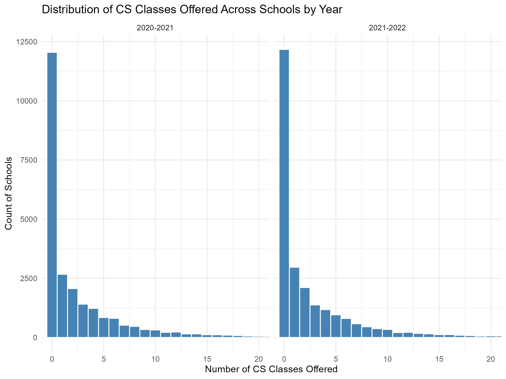

# A Multilevel Zero-Inflated Negative Binomial Model with an Applicaton to Computer Science Course Access

## Overview
This project examines disparities in access to computer science (CS) courses across U.S. K–12 schools using multilevel count models. It combines hierarchical modeling (state and district levels) with zero-inflated and negative binomial approaches to better capture both variation in course offerings and structural lack of access.

## Research Question
How do school characteristics, demographics, and institutional context shape access to computer science education—and to what extent are some schools structurally excluded from offering CS courses?

---
## Distribution of CS Course Offerings

 

*Figure: Distribution of CS course offerings in K–12 schools in the United States.*

This distribution shows a large concentration of schools offering few or no CS courses, motivating the use of zero-inflated count models.

---

## Key Insights & Policy Implications

- **Structural lack of access is widespread.**  
  The zero-inflation model suggests that a nontrivial share of schools belong to a separate group that offers no CS courses at all. This indicates that for many schools, the issue is not low supply—but complete absence of access—requiring targeted policy intervention.

- **District context matters more than state context.**  
  Variation in CS course access is larger across districts than across states, suggesting that local policies, resources, and priorities play a central role in shaping access.

- **School size strongly determines access.**  
  Larger schools offer more CS courses, but the relationship is nonlinear. Expanding access in smaller schools may require structural support rather than proportional scaling.

- **Access is concentrated at the high school level.**  
  Elementary and middle schools offer significantly fewer CS courses, indicating that exposure to CS is delayed for many students.

- **Demographic composition is systematically associated with access.**  
  Schools with higher shares of Black, Hispanic, and female students offer fewer CS courses, while schools with higher proportions of Asian students offer more. These patterns persist even after controlling for size and structure, pointing to inequities in access.

- **Juvenile justice schools face reduced access.**  
  These schools offer significantly fewer CS courses, highlighting an additional layer of exclusion in constrained educational settings.

- **An estimated ~9% of schools are structurally excluded from offering CS courses.**  
  This suggests that a meaningful portion of schools are unlikely to offer CS at all without systemic intervention.
---

## Model Comparison

Six models were estimated:

- Multilevel Negative Binomial (MNB)
- Multilevel Zero-Inflated Negative Binomial (MZINB)
- MZINB (with structural predictors of excess zeros)
- Extended MNB (the extension include more relevant demographic variables)
- Extended MZINB
- Extended MZINB (with structural predictors of excess zeros)
  
The **zero-inflated models consistently outperformed standard models**, and the inclusion of demographic variables substantially improved model fit (AIC reduction).  

The best-performing model is the **multilevel zero-inflated negative binomial model with demographic controls and structural predictors of excess zeros**, indicating that adding relevant demographics and decomposing the model into two parts while accounting for structural covariate of zero access are critical to understanding disparities in CS courses.

---

## Full Analysis

A detailed write-up of the study background, methodology, model results, and interpretation is available here:

📄 [Full Research Paper (PDF)](Full_research_paper/Full_research_paper.pdf)

---
